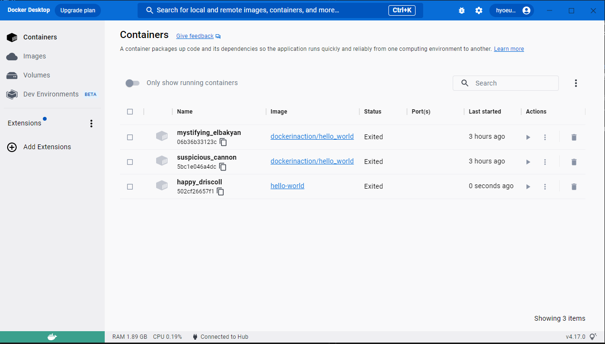

## 1. 컨테이너 기술이란 무엇입니까?
- 컨테이너 기술이란, 독립된 런타임 환경을 제공하는 소프트웨어 패키지. 가상 하드웨어를 제공하는 가상머신과 달리, OS를 가상화하여 컨테이너들 끼리 공유하므로 매우 가볍다는 특징이 있음.

## 2. 도커란 무엇입니까?
- 도커란, 일반적인 소프트웨어 문제를 해결하고 소프트웨어 서치, 실행, 게시 및 제거를 단순하기 위해 logistic 방식을 취하는 command-line 프로그램, 백그라운드프로세스 및 원격 서비스의 집함
(Docker in Action,  2/E 에서 발췌)

## 3. 도커 파일, 도커 이미지, 도커 컨테이너의 개념은 무엇이고 서로 어떤 관계입니까?
- 도커파일: 도커 이미지를 만들기 위한 command들을 담고 있는 document. ([reference](https://docs.docker.com/engine/reference/builder/))
- 도커 이미지: 도커 컨테이너 생성을 위한 지시사항들이 적혀 있는 read-only 템플릿. 도커파일에 있는 각 instruction들은 image의 한 layer을 생성함. ([reference](https://docs.docker.com/get-started/overview/#images))
- 도커 컨테이너: 컨테이너는 image를 실행할 수 있는 객체. 도커 API나 CLI를 통해 컨테이너를 생성, 시작, 중지, 이동, 삭제 등을 할 수 있음. 하나 이상의 네트워크에 연겷랄 수도 있고, 저장소를 붙일 수도 있으면, 새로운 이미지를 만들 수도 있음. ([reference](https://docs.docker.com/get-started/overview/#containers))
- 도커파일을 통해 도커 이미지를 생성하고, 도커 이미지를 토대로 도커 컨테이너를 올림

## 4. [실전 미션] 도커 설치하기
- Docker Desktop
  
